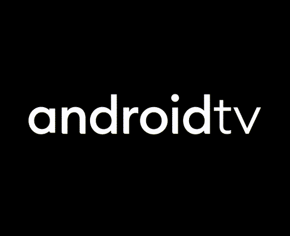

  <h1>Boot Animations for custom roms</h1>

Implements custom boot animations in `.zip` format on devices with Magisk/KernelSU (SuperSU) as its root solution/method.

These .zip files replace the default boot animation with themed ones, offering a personalized startup experience :3

  <h3>All themes are provided as magisk/ksu flashable .zip files. so just install them as a module</h3>

________________________________________________________________

| Theme | Preview | Download |
|-------|---------|----------|
| **Cyanogenmod7** |  | [android-bootfx-3.0.3-magisk.zip](https://github.com/Boffyssb2/Boot-animations-for-samsung-phones-on-a-qmg-format/releases/download/bootanimation/video2.gif) |  |
| **Cyanogenmod11** |  | [android-red-bootfx-3.0.3-magisk.zip](https://github.com/John0n1/SMbootFX/releases/download/3.0.3/android-red-bootfx-3.0.3-magisk.zip) |  |
| **Cyanogenmod11 but cool** |  | [android-green-on-black-bootfx-3.0.3-magisk.zip](https://github.com/John0n1/SMbootFX/releases/download/3.0.3/android-green-on-black-bootfx-3.0.3-magisk.zip) |  |
| **Cyanogenmod12** |  | [android-white-on-plum-bootfx-3.0.3-magisk.zip](https://github.com/John0n1/SMbootFX/releases/download/3.0.3/android-white-on-plum-bootfx-3.0.3-magisk.zip) |  |
| **Old LineageOS** |  | [miui-blue-android-on-black-bootfx-3.0.3-magisk.zip](https://github.com/John0n1/SMbootFX/releases/download/3.0.3/miui-blue-android-on-black-bootfx-3.0.3-magisk.zip) |  |
| **New LineageOS** |  | [miui-black-android-on-pink-bootfx-3.0.3-magisk.zip](https://github.com/John0n1/SMbootFX/releases/download/3.0.3/miui-black-android-on-pink-bootfx-3.0.3-magisk.zip) |  |
| **AOSPA** |  | [miui-white-android-on-black-bootfx-3.0.3-magisk.zip](https://github.com/John0n1/SMbootFX/releases/download/3.0.3/miui-white-android-on-black-bootfx-3.0.3-magisk.zip) |  |
| **CandyROM** |  | [miui-white-android-on-blue-bootfx-3.0.3-magisk.zip](https://github.com/John0n1/SMbootFX/releases/download/3.0.3/miui-white-android-on-blue-bootfx-3.0.3-magisk.zip) |  |
| **Evolution X** |  | [green-android-bootfx-3.0.3-magisk.zip](https://github.com/John0n1/SMbootFX/releases/download/3.0.3/green-android-bootfx-3.0.3-magisk.zip) |  |
| **Havoc OS** |  | [simple-android-black-on-red-bootfx-3.0.3-magisk.zip](https://github.com/John0n1/SMbootFX/releases/download/3.0.3/simple-android-black-on-red-bootfx-3.0.3-magisk.zip) |  |
| **Dot OS** |  | [kitkat-bootfx-3.0.3-magisk.zip](https://github.com/John0n1/SMbootFX/releases/download/3.0.3/kitkat-bootfx-3.0.3-magisk.zip) |  |
| **Stock Google (pixel?)** |  | [aokp-bootfx-3.0.3-magisk.zip](https://github.com/John0n1/SMbootFX/releases/download/3.0.3/aokp-bootfx-3.0.3-magisk.zip) |  |
| **ctOS (watchdogs)** |  | [aokp-magical-bootfx-3.0.3-magisk.zip](https://github.com/John0n1/SMbootFX/releases/download/3.0.3/aokp-magical-bootfx-3.0.3-magisk.zip) |  |
| **BreezeUI** |  | [white-on-black-bootfx-3.0.3-magisk.zip](https://github.com/John0n1/SMbootFX/releases/download/3.0.3/white-on-black-bootfx-3.0.3-magisk.zip) |  |
| **AndroidTV** |  | [apple-bootfx-3.0.3-magisk.zip](https://github.com/John0n1/SMbootFX/releases/download/3.0.3/apple-bootfx-3.0.3-magisk.zip) |  |
| **Sci-Fi droid** |  | [apple-electrocution-bootfx-3.0.3-magisk.zip](https://github.com/John0n1/SMbootFX/releases/download/3.0.3/apple-electrocution-bootfx-3.0.3-magisk.zip) |  |
| **AOKP red** |  | [blue-lines-a-bootfx-3.0.3-magisk.zip](https://github.com/John0n1/SMbootFX/releases/download/3.0.3/blue-lines-a-bootfx-3.0.3-magisk.zip) |  |
| **AOKP gear** |  | [ctos-bootfx-3.0.3-magisk.zip](https://github.com/John0n1/SMbootFX/releases/download/3.0.3/ctos-bootfx-3.0.3-magisk.zip) |  |
| **AOKP black and white gear** |  | [ctos-bootfx-3.0.3-magisk.zip](https://github.com/John0n1/SMbootFX/releases/download/3.0.3/ctos-bootfx-3.0.3-magisk.zip) |  |
| **IodèOS** |  | [nethunter-bootfx-3.0.3-magisk.zip](https://github.com/John0n1/SMbootFX/releases/download/3.0.3/nethunter-bootfx-3.0.3-magisk.zip) |  |
| **The Clover Project** |  | [nethunter-glitch-bootfx-3.0.3-magisk.zip](https://github.com/John0n1/SMbootFX/releases/download/3.0.3/nethunter-glitch-bootfx-3.0.3-magisk.zip) |  |
| **Reimu** |  | [nethunter-burning-bootfx-3.0.3-magisk.zip](https://github.com/John0n1/SMbootFX/releases/download/3.0.3/nethunter-burning-bootfx-3.0.3-magisk.zip) |  |
| **ArrowOS** |  | [cyanogen7-bootfx-3.0.3-magisk.zip](https://github.com/John0n1/SMbootFX/releases/download/3.0.3/cyanogen7-bootfx-3.0.3-magisk.zip) |  |
| **MistOS** |  | [oneplus-bootfx-3.0.3-magisk.zip](https://github.com/John0n1/SMbootFX/releases/download/3.0.3/oneplus-bootfx-3.0.3-magisk.zip) |  |
| **Project Elixir** |  | [pixel-bootfx-3.0.3-magisk.zip](https://github.com/John0n1/SMbootFX/releases/download/3.0.3/pixel-bootfx-3.0.3-magisk.zip) |  |
| *More coming soon!* |  |  |  |

## Important Distinctions

1. This project targets the **boot animation** that plays after the bootlogo, during the Android system startup.
2. They are not for samsung phones with stock (rooted) oneui as their os

> [!TIP]
> if you're looking for samsung .qmg bootanimations, go to https://github.com/John0n1/SMbootFX

## How It Works

the rom your on reads the bootanimation.zip file, which shows it based on its resolution and frames it was compressed with

## Installation Guide

1. **Download** your chosen boot animation
2. **Open** magisk (ksu).
3. install it as a module (duh).
4. **Reboot** your device.
5. **Enjoy** the new boot animation :3

> [!TIP]
> some bootanimations may not show (and would make your phone get stuck on the bootlogo till booting your phone without a bootanimation), so if they don't, choose another one or convert it to your phone's resolution

## Supported Devices

Most android powered devices manufactured after (before?) 2012 are supported.

Confirmed working on:

* **Galaxy A series:** A13 exynos, A5 (2017)

To confirm support for your specific device, check if the following files exist in either `/system/media/` or `/vendor/media/`:

* `bootanimation.zip`

If that file is present, your device should be compatible.

## Credits

The .zip files used in this project are made by various creators and devs, and credits goes to their respective owner

## How It Works

the rom you're on reads the bootanimation.zip file, which shows it based on its resolution and frames it was compressed with 

> [!TIP]
> if you're using SuperSU (or a non-module based root solution), just extract the module, take the bootanimation.zip and replace it to the directory thats responsible on keeping your bootanimation file

## Important Notes

- these files are only for custom roms (or non Samsung oneui/touchwiz/experience based roms).
- if you're having issues with sending them to your phone that has a custom rom, try https://github.com/agreenbhm/magic_overlayfs.
- Use at your own risk—always back up your device before modifying system files.
- inspired by https://github.com/John0n1/SMbootFX

## Troubleshooting

- If the animation doesn't change, ensure you've moved it to the right directory.

## Supported Devices

Most phones devices manufactured after 2012 are supported.

Confirmed working on:

* **Galaxy A series:** A13, A5 (2017)

To confirm support for your specific device, check if the following files exist in either `/system/media/` or `/vendor/media/`:

* `bootanimation.zip`

If that file is present, your device should be compatible.

## Contributions and Requests

Feel free to open an issue for bug reports, feature requests, or new theme suggestions.  
Pull requests are welcome for new themes or improvements!

## Credits

The .zip files used in this project are made by various creators and devs, and credits goes to their respective owner

## Notices

- This project is **not** affiliated with, sponsored, or endorsed by Samsung Electronics Co., Ltd., or any other mentioned or themed brands. All trademarks are the property of their respective owners.
- The `.zip` files are only distributed inside as replaceable files in the **Releases** section due to GitHub file size limitations.
- Be cautious when downloading forked versions—especially faulty `.zip` files—from unknown sources, as they may not boot at all.

## License

This project is licensed under the [Apache-2.0 license](LICENSE).
