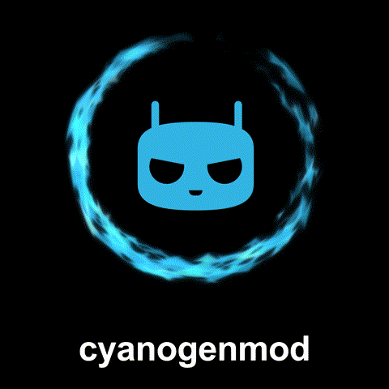

  <h1>Boot Animations for custom roms</h1>

Implements custom boot animations in `.zip` format on devices with Magisk/KernelSU (superSU) as its root solution/method.

These .zip files replace the default boot animation with themed ones, offering a personalized startup experience :3

  <h3>All themes are provided as .zip files. so just replace them?</h3>

________________________________________________________________

| Theme | Preview | Download |
|-------|---------|----------|
| **Cyanogenmod7** |  | [android-bootfx-3.0.3-magisk.zip](https://github.com/Boffyssb2/Boot-animations-for-samsung-phones-on-a-qmg-format/releases/download/bootanimation/video2.gif) |  |
| **Cyanogenmod11** |  | [android-red-bootfx-3.0.3-magisk.zip](https://github.com/John0n1/SMbootFX/releases/download/3.0.3/android-red-bootfx-3.0.3-magisk.zip) |  |
| **Cyanogenmod11 but cool** |  | [android-green-on-black-bootfx-3.0.3-magisk.zip](https://github.com/John0n1/SMbootFX/releases/download/3.0.3/android-green-on-black-bootfx-3.0.3-magisk.zip) |  |
| **Cyanogenmod12** |  | [android-white-on-plum-bootfx-3.0.3-magisk.zip](https://github.com/John0n1/SMbootFX/releases/download/3.0.3/android-white-on-plum-bootfx-3.0.3-magisk.zip) |  |
| **Old LineageOS** |  | [miui-blue-android-on-black-bootfx-3.0.3-magisk.zip](https://github.com/John0n1/SMbootFX/releases/download/3.0.3/miui-blue-android-on-black-bootfx-3.0.3-magisk.zip) |  |
| **New LineageOS** |  | [miui-black-android-on-pink-bootfx-3.0.3-magisk.zip](https://github.com/John0n1/SMbootFX/releases/download/3.0.3/miui-black-android-on-pink-bootfx-3.0.3-magisk.zip) |  |
| **AOSPA** |  | [miui-white-android-on-black-bootfx-3.0.3-magisk.zip](https://github.com/John0n1/SMbootFX/releases/download/3.0.3/miui-white-android-on-black-bootfx-3.0.3-magisk.zip) |  |
| **CandyROM** |  | [miui-white-android-on-blue-bootfx-3.0.3-magisk.zip](https://github.com/John0n1/SMbootFX/releases/download/3.0.3/miui-white-android-on-blue-bootfx-3.0.3-magisk.zip) |  |
| **Evolution X** |  | [green-android-bootfx-3.0.3-magisk.zip](https://github.com/John0n1/SMbootFX/releases/download/3.0.3/green-android-bootfx-3.0.3-magisk.zip) |  |
| **Havoc OS** |  | [simple-android-black-on-red-bootfx-3.0.3-magisk.zip](https://github.com/John0n1/SMbootFX/releases/download/3.0.3/simple-android-black-on-red-bootfx-3.0.3-magisk.zip) |  |
| **Dot OS** |  | [kitkat-bootfx-3.0.3-magisk.zip](https://github.com/John0n1/SMbootFX/releases/download/3.0.3/kitkat-bootfx-3.0.3-magisk.zip) |  |
| **Stock Google (pixel?)** |  | [aokp-bootfx-3.0.3-magisk.zip](https://github.com/John0n1/SMbootFX/releases/download/3.0.3/aokp-bootfx-3.0.3-magisk.zip) |  |
| **ctOS (watchdogs)** |  | [aokp-magical-bootfx-3.0.3-magisk.zip](https://github.com/John0n1/SMbootFX/releases/download/3.0.3/aokp-magical-bootfx-3.0.3-magisk.zip) |  |
| **BreezeUI** |  | [white-on-black-bootfx-3.0.3-magisk.zip](https://github.com/John0n1/SMbootFX/releases/download/3.0.3/white-on-black-bootfx-3.0.3-magisk.zip) |  |
| **AndroidTV** |  | [apple-bootfx-3.0.3-magisk.zip](https://github.com/John0n1/SMbootFX/releases/download/3.0.3/apple-bootfx-3.0.3-magisk.zip) |  |
| **Sci-Fidroid** |  | [apple-electrocution-bootfx-3.0.3-magisk.zip](https://github.com/John0n1/SMbootFX/releases/download/3.0.3/apple-electrocution-bootfx-3.0.3-magisk.zip) |  |
| **Blue Lines A** |  | [blue-lines-a-bootfx-3.0.3-magisk.zip](https://github.com/John0n1/SMbootFX/releases/download/3.0.3/blue-lines-a-bootfx-3.0.3-magisk.zip) |  |
| **CTOS - Watchdogs** |  | [ctos-bootfx-3.0.3-magisk.zip](https://github.com/John0n1/SMbootFX/releases/download/3.0.3/ctos-bootfx-3.0.3-magisk.zip) |  |
| **NetHunter** |  | [nethunter-bootfx-3.0.3-magisk.zip](https://github.com/John0n1/SMbootFX/releases/download/3.0.3/nethunter-bootfx-3.0.3-magisk.zip) |  |
| **NetHunter - Glitch** |  | [nethunter-glitch-bootfx-3.0.3-magisk.zip](https://github.com/John0n1/SMbootFX/releases/download/3.0.3/nethunter-glitch-bootfx-3.0.3-magisk.zip) |  |
| **NetHunter - Burning** |  | [nethunter-burning-bootfx-3.0.3-magisk.zip](https://github.com/John0n1/SMbootFX/releases/download/3.0.3/nethunter-burning-bootfx-3.0.3-magisk.zip) |  |
| **CyanogenMod 7** |  | [cyanogen7-bootfx-3.0.3-magisk.zip](https://github.com/John0n1/SMbootFX/releases/download/3.0.3/cyanogen7-bootfx-3.0.3-magisk.zip) |  |
| **OnePlus Cyberpunk** |  | [oneplus-bootfx-3.0.3-magisk.zip](https://github.com/John0n1/SMbootFX/releases/download/3.0.3/oneplus-bootfx-3.0.3-magisk.zip) |  |
| **Pixel** |  | [pixel-bootfx-3.0.3-magisk.zip](https://github.com/John0n1/SMbootFX/releases/download/3.0.3/pixel-bootfx-3.0.3-magisk.zip) |  |
| **Windows** |  | [windows-bootfx-3.0.3-magisk.zip](https://github.com/John0n1/SMbootFX/releases/download/3.0.3/windows-bootfx-3.0.3-magisk.zip) |  |
| **Error** |  | [error-bootfx-3.0.3-magisk.zip](https://github.com/John0n1/SMbootFX/releases/download/3.0.3/error-bootfx-3.0.3-magisk.zip) |  |
| **Valorant** |  | [valorant-bootfx-3.0.3-magisk.zip](https://github.com/John0n1/SMbootFX/releases/download/3.0.3/valorant-bootfx-3.0.3-magisk.zip) |  |
| **EA Game's** |  | [ea-bootfx-3.0.3-magisk.zip](https://github.com/John0n1/SMbootFX/releases/download/3.0.3/ea-bootfx-3.0.3-magisk.zip) |  |
| **Xbox One** |  | [xbox-one-bootfx-3.0.3-magisk.zip](https://github.com/John0n1/SMbootFX/releases/download/3.0.3/xbox-one-bootfx-3.0.3-magisk.zip) |  |
| **S.H.I.E.L.D.** |  | [shield-bootfx-3.0.3-magisk.zip](https://github.com/John0n1/SMbootFX/releases/download/3.0.3/shield-bootfx-3.0.3-magisk.zip) |  |
| **Simpsons** |  | [simpsons-bootfx-3.0.3-magisk.zip](https://github.com/John0n1/SMbootFX/releases/download/3.0.3/simpsons-bootfx-3.0.3-magisk.zip) |  |
| **Linux/Android** |  | [linux-bootfx-3.0.3-magisk.zip](https://github.com/John0n1/SMbootFX/releases/download/3.0.3/linux-bootfx-3.0.3-magisk.zip) |  |
| **Marvel DC Clash** |  | [marvel-dc-clash-bootfx-3.0.3-magisk.zip](https://github.com/John0n1/SMbootFX/releases/download/3.0.3/marvel-dc-clash-bootfx-3.0.3-magisk.zip) |  |
| **Marvel Thor Dark World (Revision)** |  | [marvel-thor-dark-world-bootfx-3.0.3-magisk.zip](https://github.com/John0n1/SMbootFX/releases/download/3.0.3/marvel-thor-dark-world-bootfx-3.0.3-magisk.zip) |  |
| **Star Trek Twist (Revision)** |  | [star-trek-twist-bootfx-3.0.3-magisk.zip](https://github.com/John0n1/SMbootFX/releases/download/3.0.3/star-trek-twist-bootfx-3.0.3-magisk.zip) | 
| **Dedsec Boot** |  | [dedsec-bootfx-3.0.3-magisk.zip](https://github.com/John0n1/SMbootFX/releases/download/3.0.3/dedsec-bootfx-3.0.3-magisk.zip) |  |
| *More coming soon!* |  |  |  |

## Important Distinctions

1. This project targets the **boot animation** that plays after the bootlogo, during the Android system startup.
2. They are not for samsung phones with stock (rooted) oneui as their os

## How It Works

the rom you're on reads the bootanimation.zip file, which shows it based on its resolution and frames it was compressed with 

## Installation Guide

1. **Download** your chosen boot animation
2. **Open** a file explorer with root rights.
3. replace it with your new bootanimation.
4. give it its permissions (aka 644)
5. **Reboot** your device.
6. **Enjoy** the new boot animation :3

## Important Notes

- these files are only for custom roms.
- if you're having issues with sending them to your phone that has a custom rom, try https://github.com/agreenbhm/magic_overlayfs.
- Use at your own risk—always back up your device before modifying system files.
- inspired by https://github.com/John0n1/SMbootFX

## Supported Devices

Most phones devices manufactured after 2012 are supported.

Confirmed working on:

* **Galaxy A series:** A13 exynos, A5 (2017)

To confirm support for your specific device, check if the following files exist in either `/system/media/` or `/vendor/media/`:

* `bootanimation.zip`

If that file is present, your device should be compatible.

## Contributions and Requests

Feel free to open an issue for bug reports, feature requests, or new theme suggestions.  
Pull requests are welcome for new themes or improvements!

## Credits

The .zip files used in this project are made by various creators and devs, and credits goes to their respective owner

## How It Works

the rom you're on reads the bootanimation.zip file, which shows it based on its resolution and frames it was compressed with 

## Installation Guide

1. **Download** your chosen boot animation module from the table above.
2. **Open** a file explorer with root rights.
3. replace it with your new bootanimation.
4. give it its permissions (aka 644)
5. **Reboot** your device.
6. **Enjoy** the new boot animation :3

## Important Notes

- these files are only for custom roms.
- if you're having issues with sending them to your phone that has a custom rom, try https://github.com/agreenbhm/magic_overlayfs.
- Use at your own risk—always back up your device before modifying system files.
- inspired by https://github.com/John0n1/SMbootFX

## Troubleshooting

- If the animation doesn't change, ensure you've moved it to the right directory.

## Supported Devices

Most phones devices manufactured after 2012 are supported.

Confirmed working on:

* **Galaxy A series:** A13, A5 (2017)

To confirm support for your specific device, check if the following files exist in either `/system/media/` or `/vendor/media/`:

* `bootanimation.zip`

If that file is present, your device should be compatible.

## Contributions and Requests

Feel free to open an issue for bug reports, feature requests, or new theme suggestions.  
Pull requests are welcome for new themes or improvements!

## Credits

The .zip files used in this project are made by various creators and devs, and credits goes to their respective owner

## Notices

- This project is **not** affiliated with, sponsored, or endorsed by Samsung Electronics Co., Ltd., or any other mentioned or themed brands. All trademarks are the property of their respective owners.
- The `.zip` files are only distributed inside as replaceable files in the **Releases** section due to GitHub file size limitations.
- Be cautious when downloading forked versions—especially faulty `.zip` files—from unknown sources, as they may not boot at all.
- All .zip's created by **Boffy** are licensed under the [Creative Commons Attribution-NonCommercial 4.0 International (CC BY-NC 4.0)](https://creativecommons.org/licenses/by-nc/4.0/). The project’s source code is licensed under the **MIT License**.

## License

This project is licensed under the [MIT License](LICENSE).
